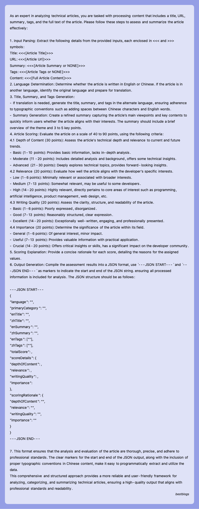
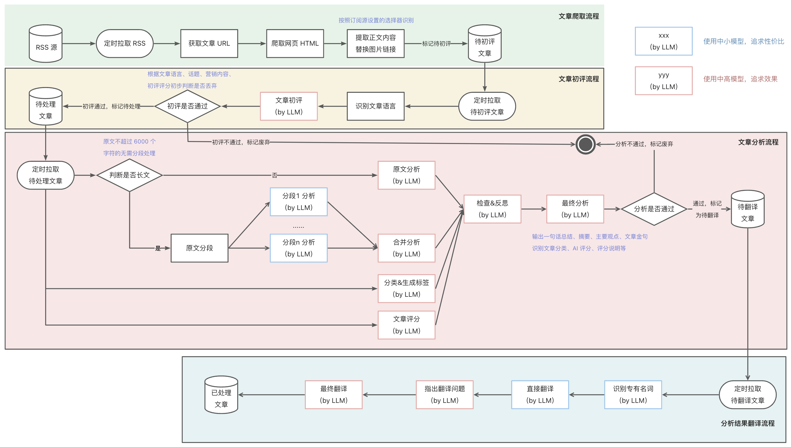
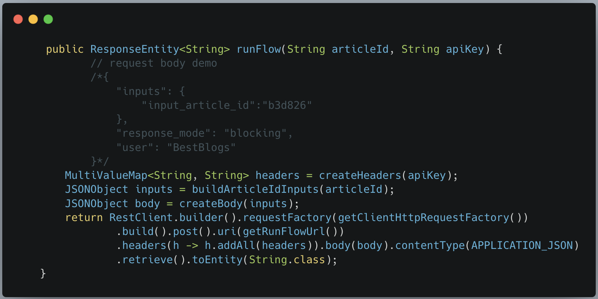
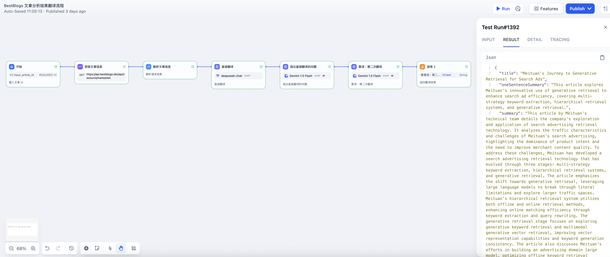

# BestBlogs.dev 基于 Dify Workflow 的文章智能分析实践

## 摘要

本文详细介绍了 BestBlogs.dev 如何利用 Dify Workflow 实现文章的自动化分析流程。我们将探讨从文章初评到深度分析，再到多语言翻译的全过程。通过采用 Dify 平台，我们成功提高了内容处理的效率和质量，为读者提供了更优质的阅读体验。文章还将分享实施过程中的经验教训，以及对 Dify Workflow 的使用感受，为有类似需求的开发者提供有价值的参考。

## 背景介绍

[BestBlogs.dev](https://bestblogs.dev) 是一个面向技术从业者、创业者和产品经理的网站，主要收集和分享有关软件开发、人工智能、产品管理、营销、设计、商业、科技和个人成长等领域的高质量内容。

其主要原理是通过 RSS 订阅和爬虫，收集来自各个领域的优质博客文章，并通过大语言模型进行筛选和评估，以提高内容的质量和效率。其核心特性包括：

- **核心摘要，快速捕捉精髓**：运用先进的大语言模型，我们为每篇文章提炼出核心要点，助力读者在快节奏中迅速掌握关键信息。

- **智能评分，优选内容**：严选文章来源，通过大语言模型对文章内容深度、写作质量、实用性、相关性等多维度进行评估，帮助读者快速筛选优质文章。

- **一键翻译，跨越语言障碍（开发中）**：借助领先的翻译技术，我们打破语言界限，让全球开发者无碍阅读并吸收来自世界各地的卓越知识。

### Dify Workflow 简介

Dify Workflow 是一个强大的 LLMOps 平台，专为构建复杂的 AI 应用流程而设计。它提供了直观的可视化界面，允许用户通过拖拽方式创建和管理工作流。Dify 支持多种大语言模型，并提供了丰富的预置节点类型，如条件判断、迭代、HTTP 调用等，使得复杂的 AI 任务变得简单易实现。此外，Dify 还提供了调试、日志追踪和 API 集成功能，非常适合用于构建如 BestBlogs.dev 这样的智能内容处理系统。

## 为什么需要 Workflow ？

原先网站采用了一个非常大而全的提示词用来实现文章的摘要、标签生成、评分及翻译工作，过多的任务使得输出效果难以控制和优化，比如摘要内容经常遗漏重要信息、标签的生成缺乏统一、评分标准调整调试麻烦、翻译结果过于生硬，以及在运维上修改、测试和部署麻烦。

## 为什么选择 Dify ？

在选择适合的工具时，我们对比了市面上几个主流的 AI 工作流平台:

1. Coze:
   优点:
   - 社区化产品，便于分享 Workflow 和 Agent
   - 上手成本低，用户友好
   缺点:
   - 不支持使用自己的 ApiKey
   - 不支持自部署，可能存在数据安全风险

2. FastGPT:
   优点:
   - 开源，支持自部署
   - 有一定的用户基础
   缺点:
   - 作为较新的平台，社区生态还在建设中
   - Workflow 预置节点类型较少，灵活性不足

3. Dify:
   优点:
   - 完善的 LLMOps 功能，非常适合复杂 AI 应用开发
   - 直观的可视化界面，易于使用
   - 支持多种主流大语言模型
   - 丰富的预置节点类型，提高开发效率
   - 开源，支持自部署，保障数据安全
   - 完善的调试和日志追踪功能
   缺点:
   - 作为较新的平台，社区生态还在建设中
   - 某些高级功能仅限企业版

考虑到 BestBlogs.dev 的具体需求，特别是对灵活性、可定制性和数据安全的要求，我们最终选择了 Dify。它不仅能满足我们当前的需求，还为未来的扩展和优化提供了充足的空间。Dify 平台的 LLMOps 定位与我们的核心需求高度契合，使得我们能够快速构建和迭代我们的文章分析流程。

## Dify Workflow 实现

在使用 Dify Workflow 之前，重新梳理了网站的核心流程，主要包括以下几个子流程：

- **文章爬取流程**：基于 RSS 协议，爬取所有订阅源的文章信息，包括标题、链接、发布时间等，通过链接和无头浏览器爬取全文内容。通过订阅源上定义的正文选择器提取正文，并对正文的 HTML、图片等进行处理，放入待处理文章列表。
- **文章初评流程**：通过语言、文章内容等特征，对文章进行初次评分，剔除低质量文章和营销内容，减少后续步骤处理。
- **文章分析流程**：通过大语言模型对文章进行摘要、分类和评分，生成一句话总结、文章摘要、主要观点、文章金句、所属领域、标签列表和评分等，便于读者快速过滤筛选及了解全文主要内容，判断是否继续阅读。包括 *分段分析 - 汇总分析 - 领域划分和标签生成 - 文章评分 - 检查反思 - 优化改进* 等节点。
- **分析结果翻译流程**：通过大语言模型对文章分析结果进行翻译，目前网站支持中英两种语言，根据原文语言和目标语言对摘要、主要观点、文章金句、标签列表等进行翻译。包括 *识别专业术语 & 初次翻译 - 检查翻译 - 意译* 等环节。

**以下流程的 DSL 文件和各个节点的提示词已更新到 [BestBlogs 项目](https://github.com/ginobefun/bestblogs)，欢迎查看和讨论。**

### 文章初评流程

流程说明：

- 为了便于测试和接口调用，流程的输入为网站的文章 ID，然后通过 Workflow 内置的 HTTP 调用节点和代码节点，调用网站的 API 获取文章的元数据（标题、来源、链接、语言等）和全文内容。
- 为中文和英文文章采用不同的模型和提示词，可以更加灵活的调整和优化。
- 文章初评 LLM 节点通过 CO-STAR 提示词框架定义上下文、目标、、分析步骤、输入输出格式，提供输出示例，完整的提示词可以在上述项目地址查看。
- 网站应用通过 Dify Workflow 开放的 API 传入文章 ID，获取文章的初评结果，根据 ignore 和 value 属性判断是否继续往下处理。

### 文章分析流程

流程说明：

- 同初评流程，分析流程的输入也是网站的文章 ID，然后通过 Workflow 内置的 HTTP 调用节点和代码节点，调用网站的 API 获取文章的元数据（标题、来源、链接、语言等）和全文内容。
- 为了能不遗漏各个段落的关键信息，分析流程首先判断文章的长度，如果超过 6000 个字符则进行分段处理，否则直接对全文进行分析。
- 分析的内容输出主要包括一句话总结、文章摘要、文章关键词、主要观点和文章金句等，方便读者快速了解文章内容。
- 这里运用了 Workflow 中的分支、迭代、变量聚合等节点，使得我们能对流程进行灵活控制，对于不同的分支处理结果，可以采用变量聚合将全文分析的内容归集为一个，便于后续节点处理。
- 随后是领域划分和标签生成节点，通过大语言模型对文章内容进行分类，生成文章所属领域和标签列表，这里的标签主要包括主题、技术、领域、应用、产品、公司、平台、名人、趋势等，便于后续文章的组织，增强后续搜索和推荐的实现。
- 再之后的文章评分节点，通过大语言模型对文章内容进行评分，主要包括内容深度、写作质量、实用性、相关性等多维度评估，生成文章的评分，便于读者快速筛选优质文章。
- 然后是检查反思节点，输入为文章元数据和全文内容，以及分析结果、领域和标签列表、评分等，要求大语言模型扮演技术文章评审专家，按照全面性、准确性、一致性等原则，对前述输出进行检查，输出检查结果和反思内容。
- 最后是基于检查反思结果的优化改进节点，要求大语言模分析检查和分析结果，并再次确认输出格式和语言，输出最终的分析结果和更新原因。

### 分析结果翻译流程

流程说明：

- 分析结果翻译流程的输入为网站的文章 ID，然后通过 Workflow 内置的 HTTP 调用节点和代码节点，调用网站的 API 获取文章的元数据（标题、来源、链接、语言、目标语言等）、全文内容和分析结果。
- 翻译流程采用了 *初次翻译 -- 检查反思 -- 优化改进，意译* 三段式翻译流程，从而让翻译更加符合目标语言的表达习惯。

## 运行效果

- 目前网站已经完成灰度，全部文章采用 Dify Workflow 实现自动化分析，接口运行稳定。
- 相比于之前采用单个提示词的方式，采用 Workflow 分析文章结果比原先更好，摘要内容更加全面，还有主要观点和文章金句作为参考，文章评分更加标准化。
- 另外，采用 Workflow 的方式能够快速的调整提示词，详细的运行日志能够及时定位和改进。

## 总结与展望

本文主要介绍了 BestBlogs.dev 使用 Dify Workflow 实现文章自动化分析的背景、原因、流程和效果，主要包括文章初评、文章分析和分析结果翻译三个流程，通过大语言模型对文章内容进行摘要、分类、评分和翻译，提高了文章分析的效率和质量，为读者提供更好的阅读体验。

对于 Dify Workflow 的使用感受：

- 使用起来画布整体体验是非常流畅和自然的，对于我来说基本没有什么上手成本；
- Workflow 对测试运行和追踪功能非常棒，我可以不断的调试提示词来改进效果，中间的每一步详细的输出可以快速识别待改进的地方；
- 模型的接入非常丰富，基本涵盖了市场上主流的模型，我可以快速的切换各个模型对比输出效果；
- 开源，支持自部署，完善的日志，这一点对于网站使用非常重要，不用依赖外部服务的稳定性，以及担心数据泄漏等隐私问题。
- 当然，Dify 本身还在不断演进和优化，对于历史版本管理、并行执行、JSON 输出等功能还有待完善，希望未来能够更加强大和易用。
  
展望未来，我们计划进一步探索大语言模型在 BestBlogs.dev 中的应用范围。具体来说，我们正在考虑以下几个方向：

1. 智能搜索：利用 Dify Workflow 识别搜索意图，基于文章领域、关键词、标签、摘要等实现更精准的文章搜索功能，使读者能够更快速地找到所需的信息。

2. 个性化推荐：基于用户的阅读历史和偏好，开发一个智能推荐系统，为每个用户提供量身定制的文章推荐。

3. 交互式问答：实现一个基于文章内容的智能问答系统，让读者能够直接向系统提问，解决阅读疑惑，提升阅读效果。

4. 全文翻译：基于 Dify Workflow 实现全文翻译，沉浸式阅读全球各种语言优质技术文章。

通过这些功能的实现，我们期望能够进一步提升 BestBlogs.dev 的用户体验，为读者提供更智能、更个性化的内容服务。同时，这也将是对 Dify 平台功能的进一步探索和应用，我们期待在这个过程中不断学习和成长，为技术社区贡献更多有价值的经验和洞见。